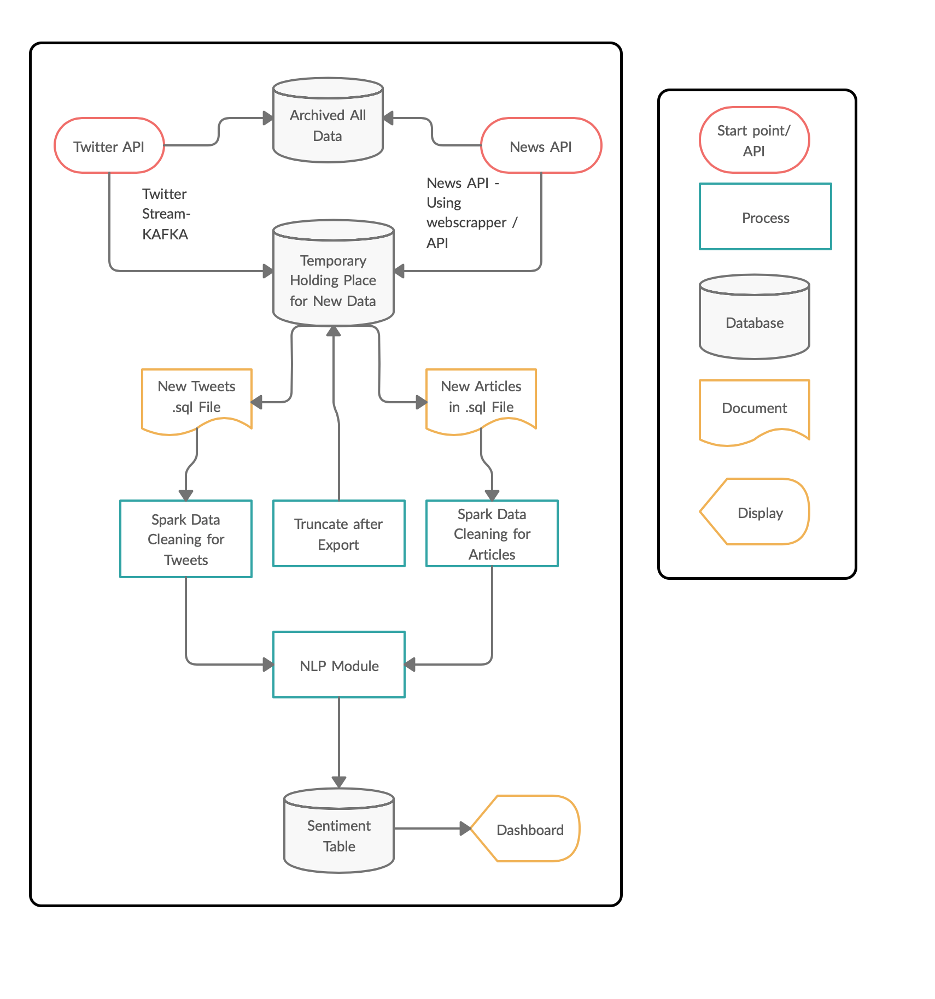
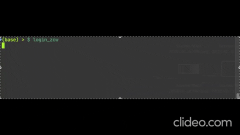
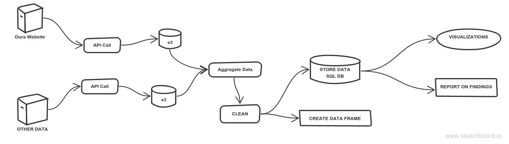
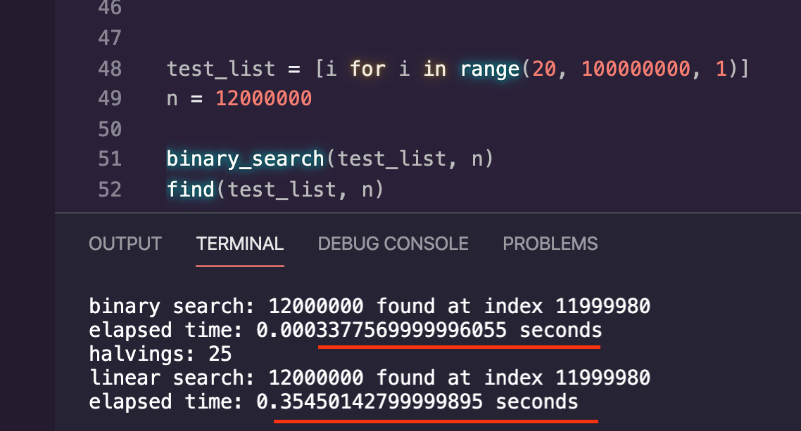

### [Covid-19 Sentiment Pipeline](https://github.com/jlat07/DataZCW-Final-Project)  
  

- Airflow  
- Kafka  
- Spark  
- Dashboard  
  

---
### [Automation Login](https://github.com/jlat07/Automation-Login)  
 
  
- Selenium  
- Chrome Headless Browser  
- Cron Job   

---
### [Airflow Oura Ring Pipeline](https://github.com/jlat07/airflow_home)  
  

- Airflow  
- urlib 
- PANDAS  
- Oauth2  
  

---
### [JLAT Black Jack](https://github.com/jlat07/PythonFundamentals.Labs.BlackJack)  
  
  
- Classes  
- Unit Test  
- Terminal 
  

---
### [Binary Search](https://github.com/jlat07/PythonFundamentals.Exercises.Algos)  
  

- Algorithms 
- Augmentation
- 

---
<!-- ### [Future Project]()  
  
  
-   -->